# 极验4代逆向分析(扣代码)

## 免责条款

本文仅用于**安全技术研究与学习交流**，记录笔者对极验4代验证码前端逻辑的分析过程，目的是理解其反爬手段的技术实现原理。

- 所有分析均针对公开可获取的**前端 JavaScript 代码**，不涉及任何服务端系统的入侵、破坏或数据窃取。
- 本文不提供可直接用于绕过验证码的成品工具，也**不鼓励、不授权**任何人将本文内容用于批量注册、刷单、薅羊毛、爬取受保护数据等违反目标网站服务条款或相关法律法规的行为。
- 读者依据本文进行的一切操作及其后果，由读者自行承担，与作者无关。
- 若本文内容侵犯了相关方的合法权益，请联系作者删除。

请在**合法合规**的前提下、出于学习目的阅读本文。

## 大致步骤

- 📝 **抓包分析** — 请求包结构，以及 gct4 风控包在这里扮演的角色
- ⚙️ **参数分析** — w 内各字段（pow / biht / gee_guard / lot 派生对象 / em）的生成算法
- 🧩 **w 的组装** — AES + RSA 两段拼接，new_track 与 td 的先后关系
- ⚠️ **注意事项** — 移植代码时最容易踩的几个坑

## 抓包分析

### 1. 请求包
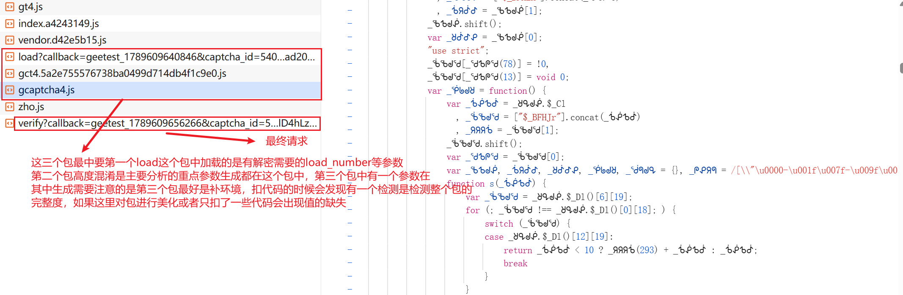
这里有一个坑必须说一下gct4.5a2e这个包最好是整个拿下来然后补环境，这里我比较懒因为发现了这里有对代码完整度的检测就直接拿模型去补了，还可以提供一个思路拿两套代码再对本代码进行检测的时候将检测对象指向完整的js文件也是可以的后面会展示这部分在哪里。

## 参数分析
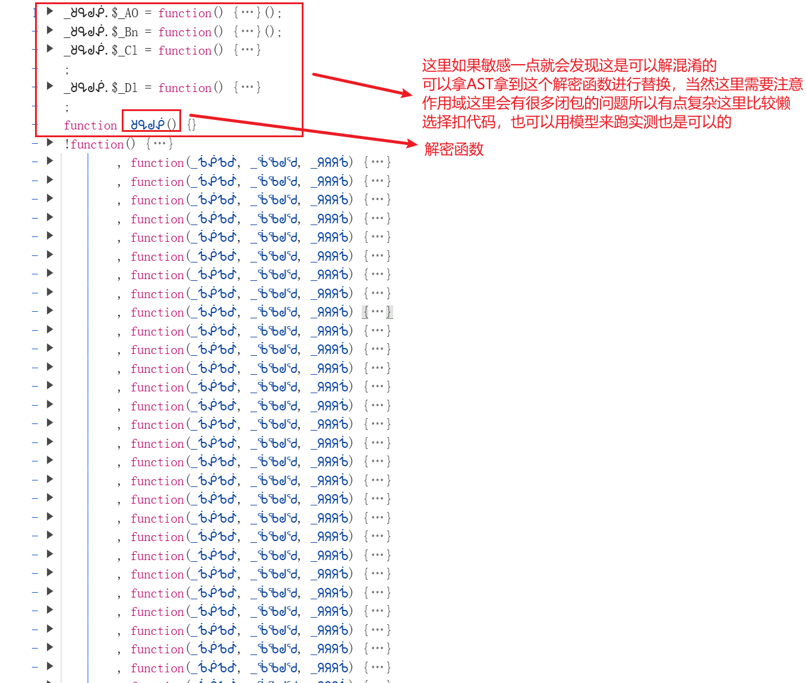
本文不对混淆进行分析了只提供思路
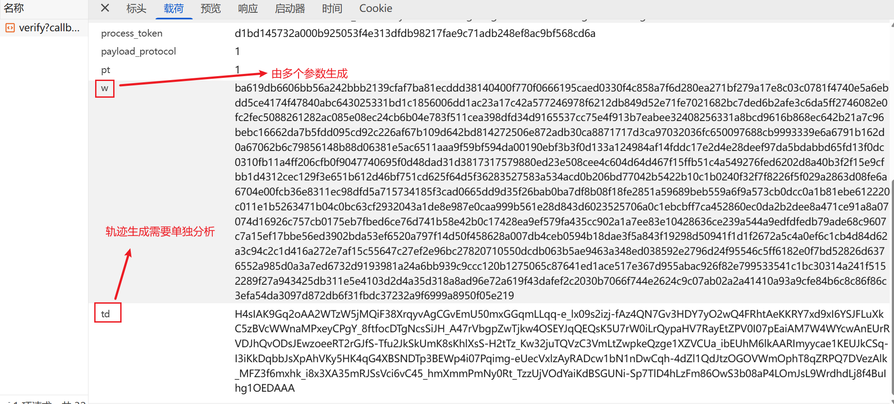
w参数有多个参数生成下面会看到，td参数则是根据滑动的轨迹生成
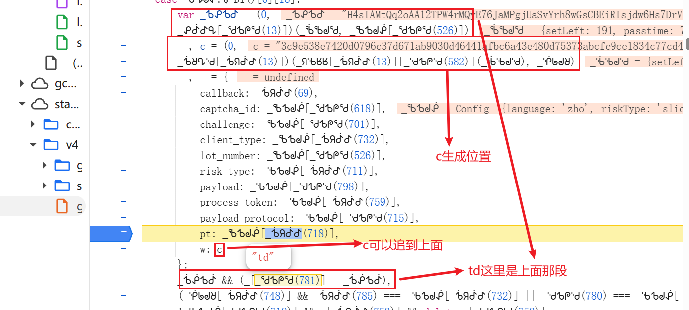
这里是生成位置每一个可以追进去分析我们先追w参数
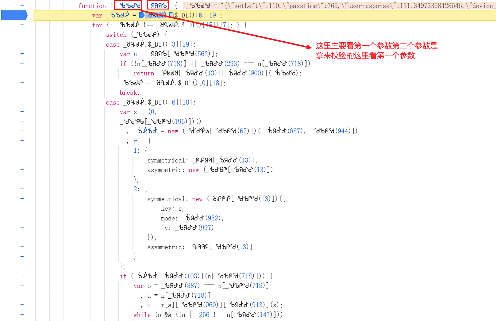
这里主要是第一个参数参加加密，第二个参数只有一小部分的参加判断
```
{
  "setLeft": 110,
  "passtime": 765,
  "userresponse": 111.34973358428546,
  "device_id": "",
  "lot_number": "d41743041fd24ebca64996293820e9fa",
  "pow_msg": "1|8|sha256|2026-09-17 10:43:26.317541+08:00|54088bb07d2df3c46b79f80300b0abbe|d41743041fd24ebca64996293820e9fa||9b94af39d34627b8",
  "pow_sign": "009eb3f3e3154833e2364a242f5b699f730e3b7831cfeea2074a82e562704fad",
  "geetest": "captcha",
  "lang": "zh",
  "ep": "123",
  "biht": "1426265548",
  "gee_guard": {
    "roe": {
      "aup": "3",
      "sep": "3",
      "egp": "3",
      "auh": "3",
      "rew": "3",
      "snh": "3",
      "res": "3",
      "cdc": "3"
    }
  },
  "dQFB": "BoHp",
  "30441f": {
    "96293820": {
      "d474": "41fd24eb"
    }
  },
  "em": {
    "ph": 0,
    "cp": 0,
    "ek": "11",
    "wd": 1,
    "nt": 0,
    "si": 0,
    "sc": 0
  },
  "td_sign":"e68335473dbe59d7d5276ef88426a6455c689d8f9e63c5549426e7a98450f045"
}
```
这段是第一个参数的值我们一个一个来分析，前面有些参数是load包中的这里就不重复分析了比如device_id、lot_number等
先看pow_msg、pow_sign
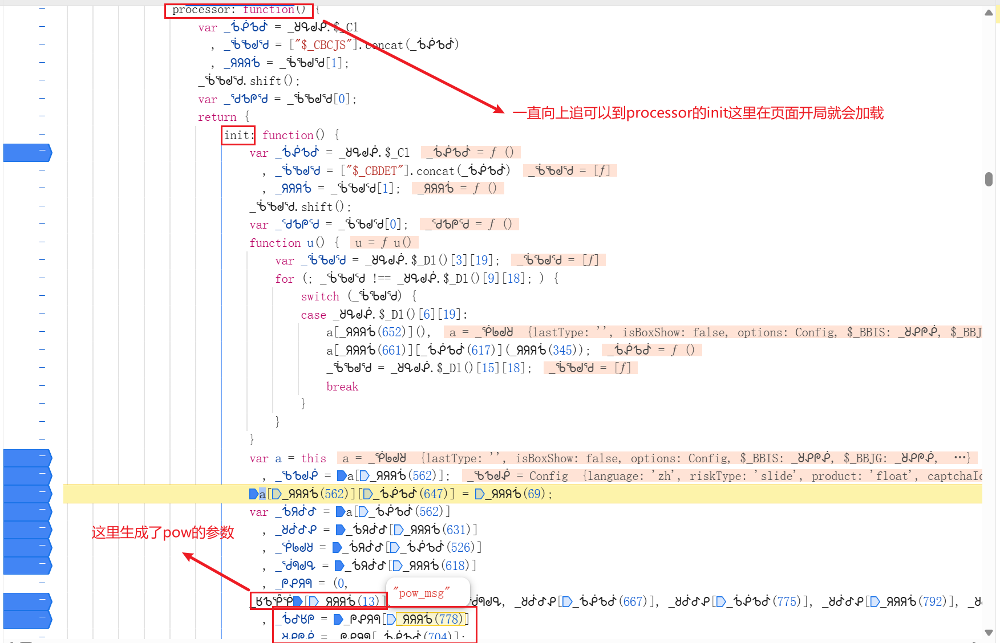
这条串一共 8 段、用 `|` 分隔，顺序是 `version|bits|hashfunc|datetime|captchaId|lotNumber|salt|随机后缀`：

| 段 | 示例值 | 含义 |
|---|---|---|
| 1 | `1` | version，来自 load 下发的 pow_detail |
| 2 | `8` | bits，难度位，决定要撞出几个前导 0 |
| 3 | `sha256` | hashfunc |
| 4 | `2026-09-17 11:25:22.449966+08:00` | datetime |
| 5 | `54088bb0…` | captchaId |
| 6 | `d4174304…` | lotNumber |
| 7 | 空 | salt，调用点恒传 `""` |
| 8 | `9b94af39…` | guid 生成的随机后缀，每次重试都换 |

前 7 段全部来自 load 包下发的 pow_detail 与 options，只有第 8 段是前端随机生成的；把整串做哈希，直到满足 bits 规定的难度条件才停 —— 这就是 PoW 的实现。我们进入生成函数
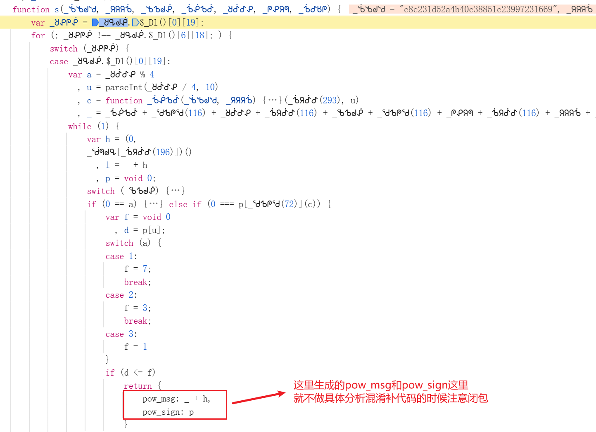
这里生成了pow_msg和pow_sign具体代码分析可以看pow.js中的具体分析，接下来分析gee_guard
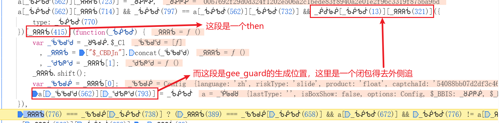
追进去可以看到下面这块
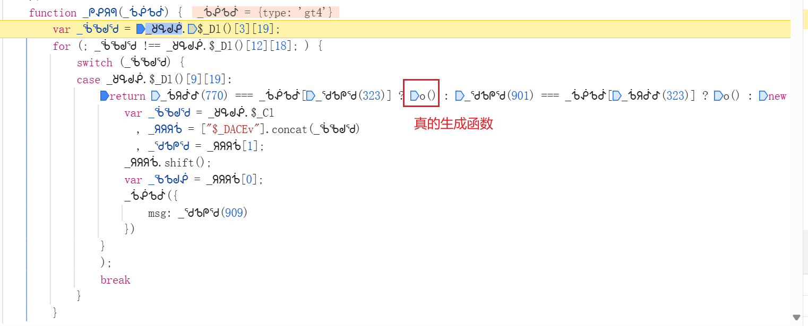
继续追直到这里
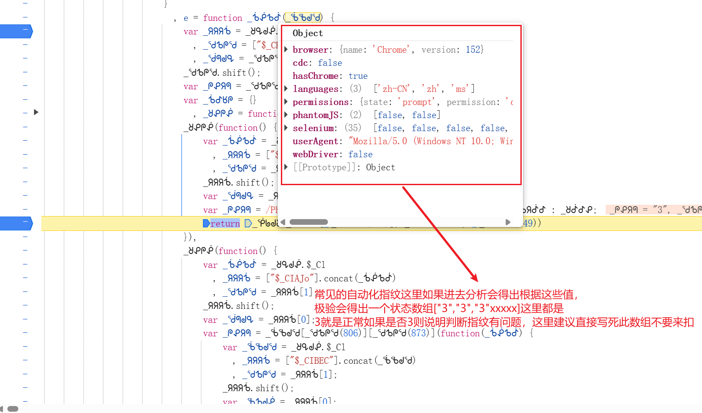
这里可以得出gee_guard就是一个指纹检测数组，通过检测指纹产生特征数组
如果想知道内部算法可以自己去扣看一下这里不在阐述，推荐直接写死3
```
{
    "aup": "3",
    "sep": "3",
    "egp": "3",
    "auh": "3",
    "rew": "3",
    "snh": "3",
    "res": "3",
    "cdc": "3"
}
```
接着到biht参数此参数需要注意其实现不在混淆代码中而是在`gct4.xxxxxx.js`的js包中这里可以通过混淆代码找到其具体实现
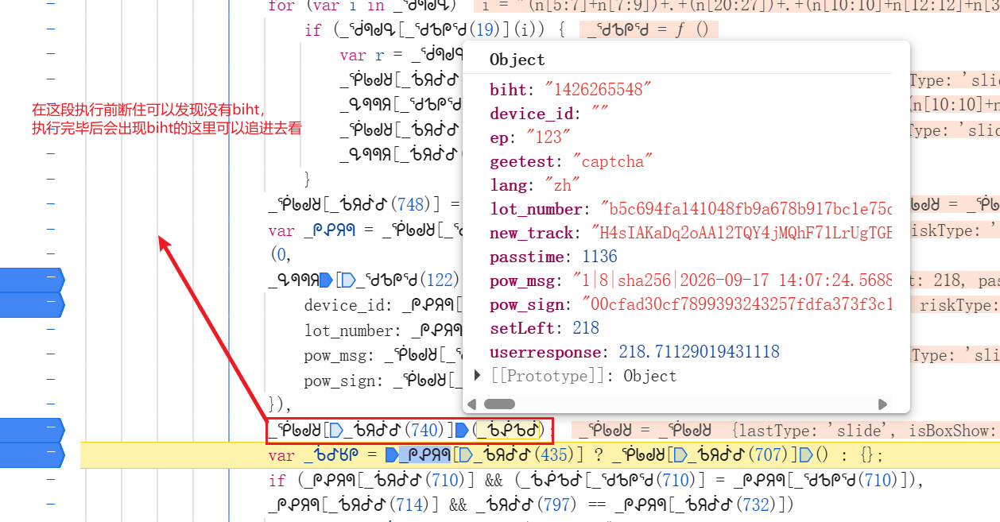
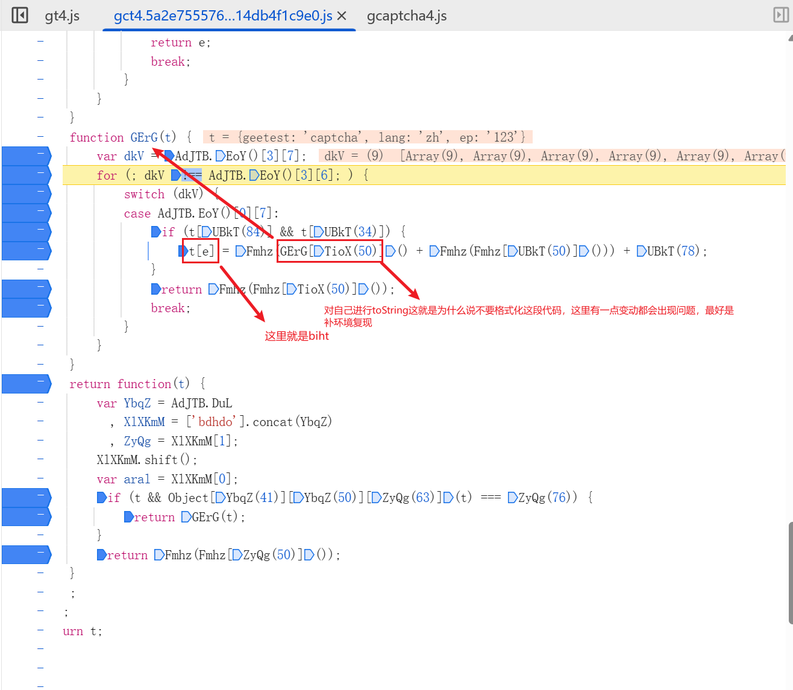
这里注意是gct4.5a2e755576xxxx.js这个包不是混淆的包然后这里追到GErG就可以看到具体复现代码这里其中有一段对GErG的toString，最好是补环境不要改变代码的原始格式缺少一个空格一个回车都会改变biht的值，
接着看
```
"dQFB": "BoHp"
"30441f": {
    "96293820": {
      "d474": "41fd24eb"
    }
}
"em": {
    "ph": 0,
    "cp": 0,
    "ek": "11",
    "wd": 1,
    "nt": 0,
    "si": 0,
    "sc": 0
  },
```
"dQFB": "BoHp"这段可以这样得到
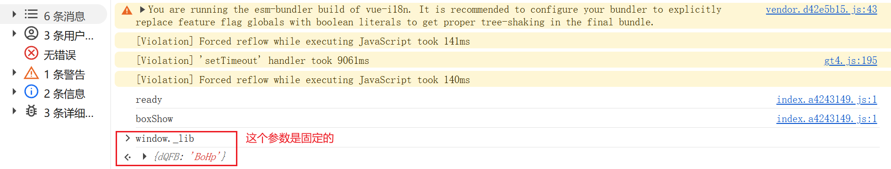
30441f这个对象和em我们一块看，这两个很近，这里30441f这个我后面会统称对象参数会由一个lot和lotRes这两个参数产生，具体看下面分析
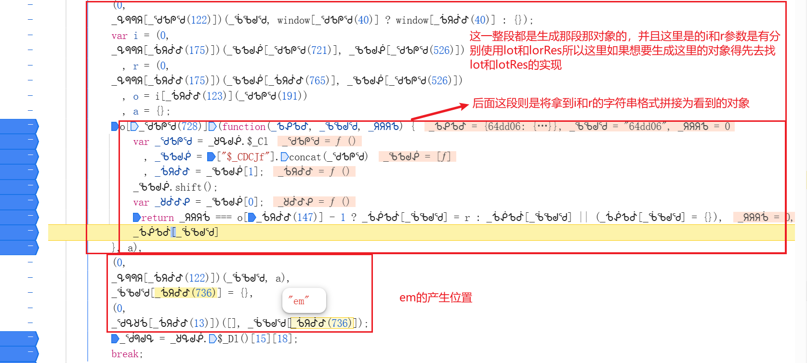
这里需要注意的一点是i和r因为lot和lotRes是动态的所以也是动态的无法复用
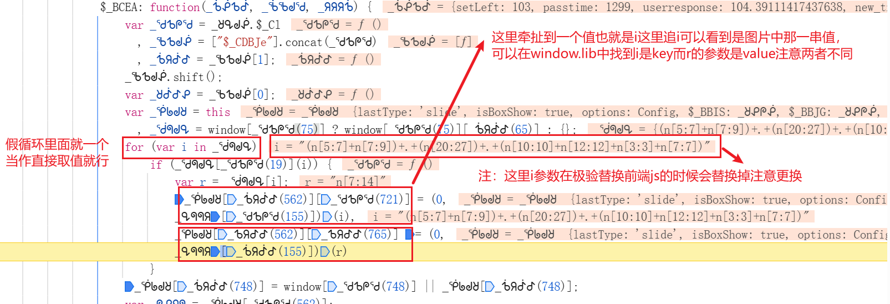
这里就是两个参数lot和lotRes产生的地方内部都会返回一个极验构造的一个r对象这个对象的方法挂在的原型(prototype)上注意一下即可,扣的时候特别注意下this的作用域，这两个参数应该是一套生成算法，接着回头看对象函数的生成其中有一个a值得注意这里这个就是结果集合断点的时候可以注意一下，其实拿到i和r自己跑一个对象也完全没问题类似这种
```
i="7e88de.c741d9bb.94a8"
r="8de994da"
{
    "c741d9bb": {
        "94a8": "8de994da"
    }
}
```
这里就不解释了我们看em
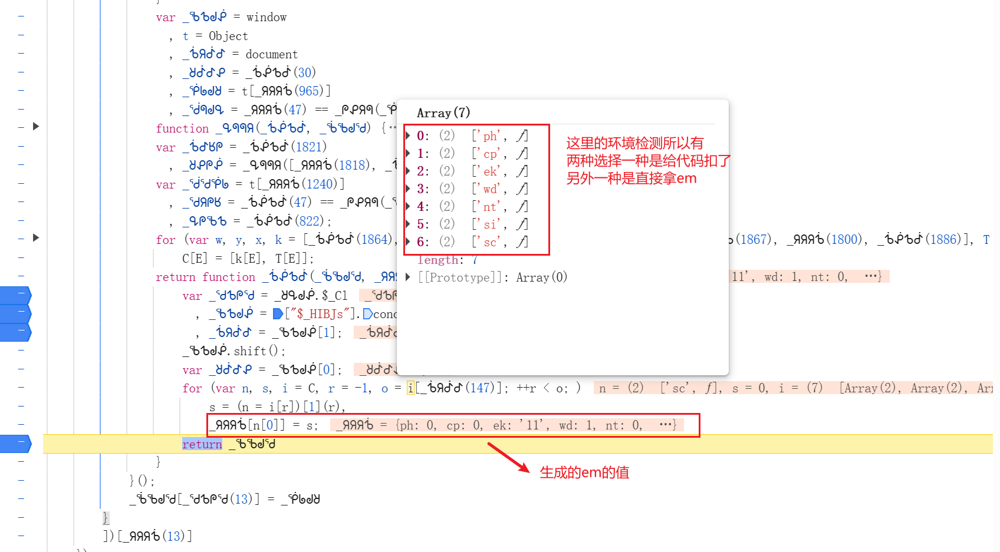
里面是有一些环境检测的可以确定是固定值直接拿比较方便推荐直接拿em这里极验更新了实测em也没有变化最后到w的生成位置
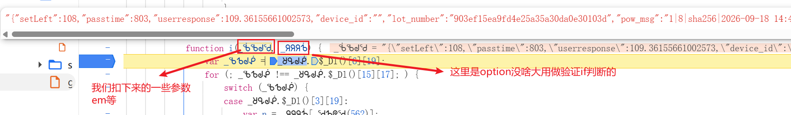
继续追可以找到w的组装位置
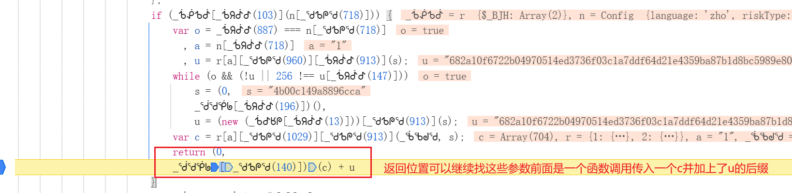
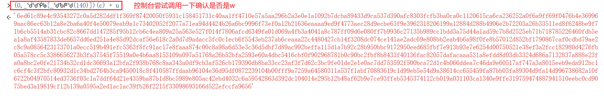
先看u怎么生成的
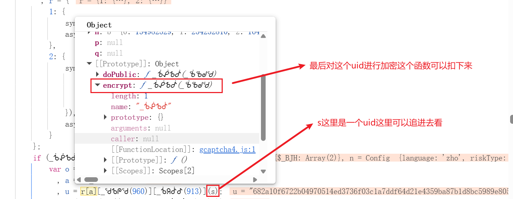
```
var c = r[a][_ᖁᕹᖘᖁ(1029)][_ᖁᕹᖘᖁ(913)](_ᖄᖃᖙᖁ, s);
```
这段也是同理s就是uid，_ᖄᖃᖙᖁ则是我们的特征列表然后就可以得到一个参数c是一个长度为704的数组，最后一步
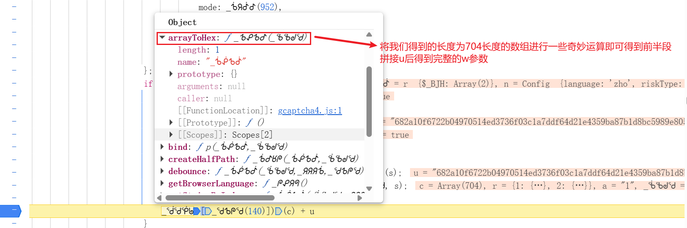
不要忘记还有请求还得带上td参数这里td就在w的不远处很好找
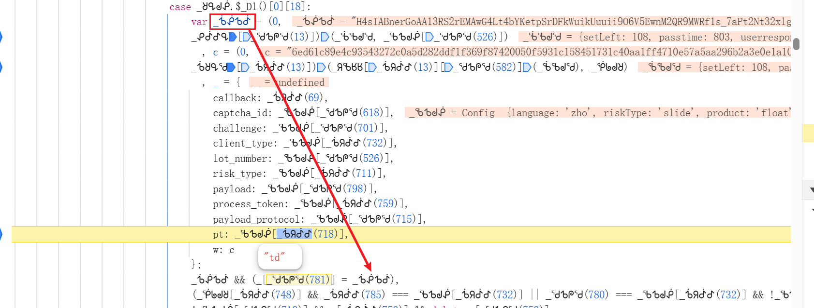
传入两个参数第一个参数是我们w的第一个参数的对象形态，第二个参数是lotNumber
这里有一个参数我忘记提了就是new_track这里给出生成位置
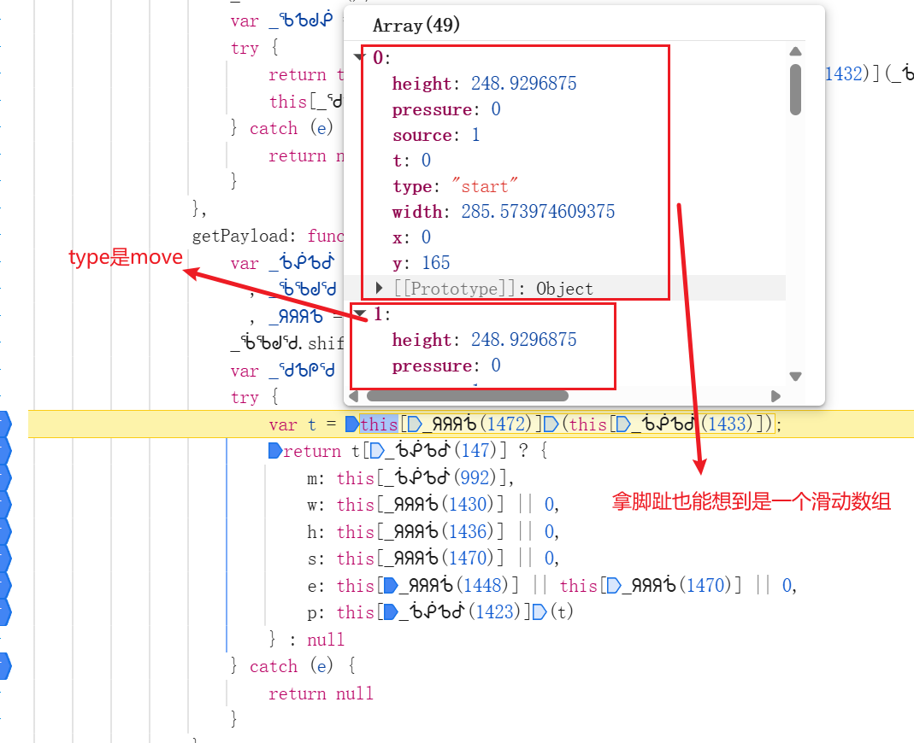
```
{
  m: this[_ᕺᕶᕹᕸ(992)], // souce可以固定为1
  w: this[_ᖆᖆᖆᕺ(1430)] || 0, width这里是300.60418701171875
  h: this[_ᖆᖆᖆᕺ(1436)] || 0, height这是262.03125
  s: this[_ᖆᖆᖆᕺ(1470)] || 0, startTime这是1789718609521时间戳
  e: this[_ᖆᖆᖆᕺ(1448)] || this[_ᖆᖆᖆᕺ(1470)] || 0, endtime同样也是时间戳
  p: this[_ᕺᕶᕹᕸ(1423)](t) 归一化的数组
}
```
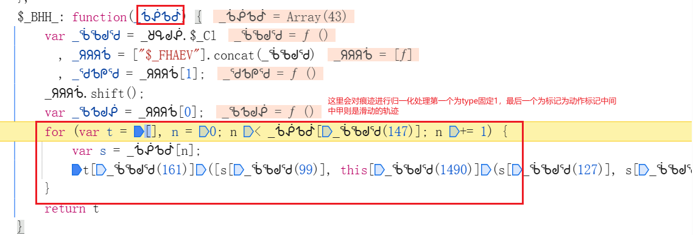
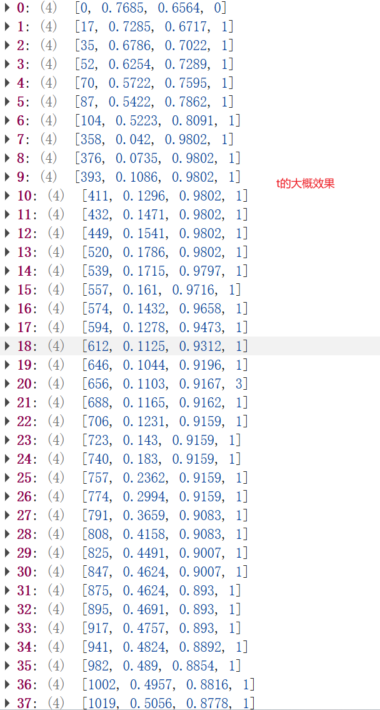
这里注意下这里大小是bg的大小
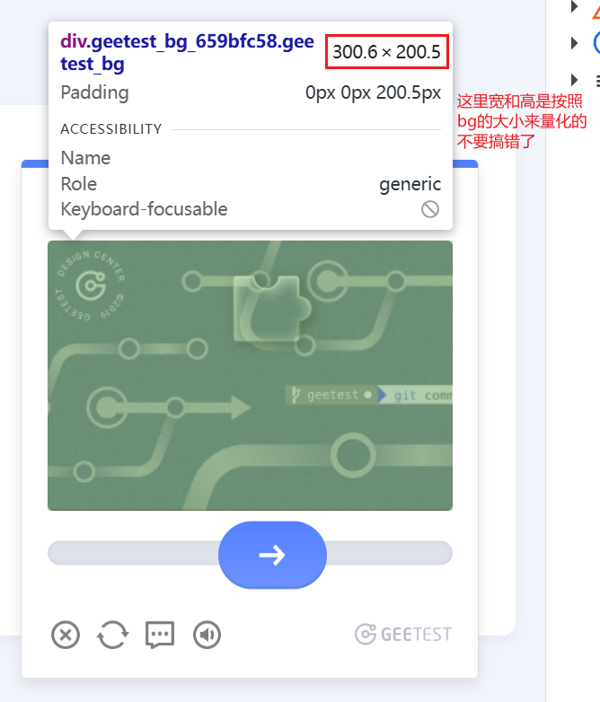
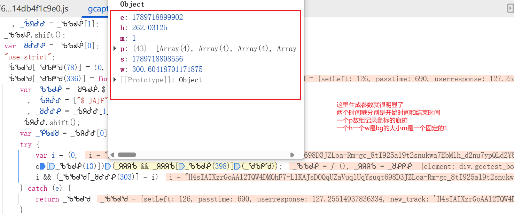
先将这段参数字符化然后第一步走strToU8，再走gzipSyn
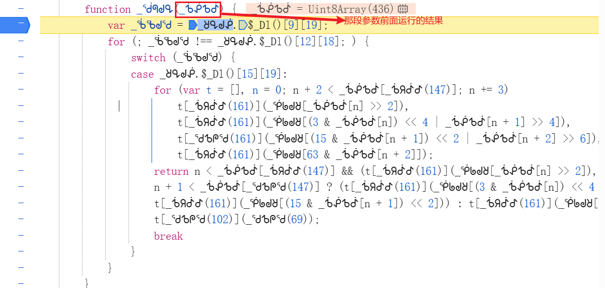
最后经过一段纯算得出new_track我们回到td的生成环节
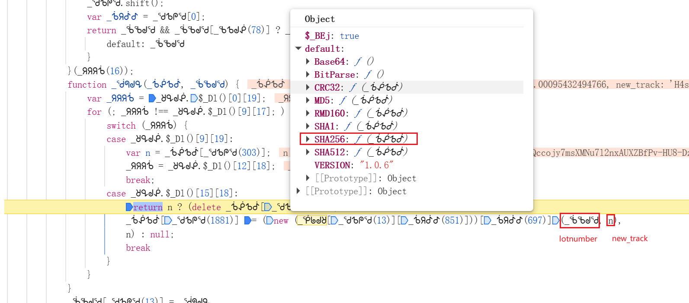
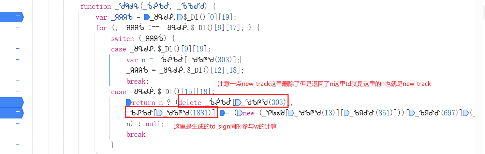
前面忘记提了这里w计算中是有一个td_sign的就是在这里产生的由new_track计算得到
## 附上成功结果
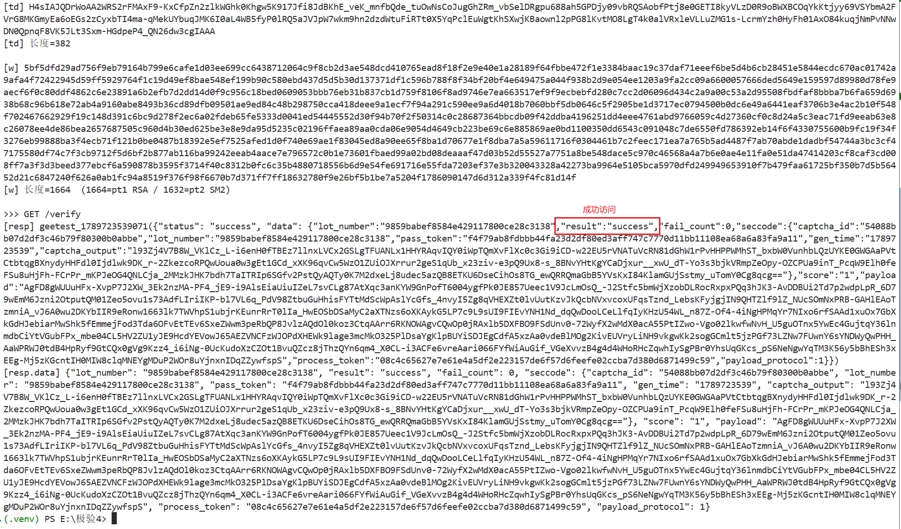

## 注意事项

下面几条是移植过程中真正卡人的地方，共同点是**不报错、但结果悄悄错**，建议动手前先看一遍。

### 1. 混淆器的名字池是「文件级」的，绝对不要把模块拼在一起

混淆器给每个标识符分配的短名（如 `_ᖁᕹᖘᖁ`）**只在单个文件内保证唯一**。把两个模块的代码拼进同一个作用域后，两边的短名会撞车，而 JS 不会报任何错——只是某个变量被静默劫持。症状是：跑出来的 w 长度对、格式对、字段也齐，**值全错**。

正确做法是**一个模块一个独立作用域**（一个文件 / 一个 IIFE / 一个 `new Function`），模块之间靠**位置**接线，不靠名字。

### 2. Node 的 CJS 和 webpack 的形参顺序是反的

```
Node CJS :  (exports, require, module, __filename, __dirname)
webpack  :  (module, exports, __webpack_require__)
```

`module` 和 `exports` 的位置对调了。整块搬模块时如果直接套 Node 的签名去接，`module.exports = …` 会写到 `exports` 上，**静默失效**，下游 `require` 拿到空对象。

### 3. `new_track` 的 gzip 只能用真 pako，zlib 复刻不出来

上面第 27 张图说到「strToU8 → gzipSyn」，这一步的坑比看上去深。

实测（输入为 395 B ~ 79 KB 的轨迹 JSON，重复拉长）：

| 对比对象 | 结果 |
|---|---|
| 真 pako `gzipSync` vs Node `zlib.gzipSync`(lvl 6 / 9) | **全部不等**，最短的 395 B 输入就已经不同 |
| 真 pako vs Python `zlib` 裸 deflate(lvl 1–9 × memLevel 8/9 × 5 种 strategy) | **全部不等**，扫遍参数组合没有一个能对上 |

也就是说这不是「调一下压缩级别就能对齐」的差异，而是 pako 的 JS 实现和 zlib 的 C 实现**在匹配查找/哈夫曼树构造上本来就不同**，任何输入长度都对不上。不过两边的**解压结果完全一致**——所以服务端能正常解，只是你复刻出来的字节不同。

**结论：这一段老老实实加载抠出来的那个 pako 模块，别用 Python 的 zlib 重写。**

另外补充一个容易误判的细节：pako 的 gzip 头里 **MTIME 写的是当前 unix 时间**（`1f8b0800` 后面那 4 字节），所以同一个输入隔一秒跑两次，输出字节就不一样。这是正常的、服务端会忽略该字段，但**别拿它做哈希比对**——要比对先把这 4 字节清零。

### 4. djb2 依赖 JS 的 int32 溢出语义

`biht` 里的 djb2 是：

```js
let e = 5381; while (n--) e = (e << 5) + e + t.charCodeAt(o++); e &= ~(1 << 31);
```

`(e << 5) + e` 会超出 32 位并**回绕**，这是 JS 位运算的语义。用 Python 的无限精度整数照抄，**短输入能对上、长输入必错**。

同理，上面第 10~11 张图那段也说过：`biht` 哈希的是函数的**源码原文**，任何重排版（加换行、加缩进、改引号）都会改变结果。实测：原版文本 → `1426265548`（与浏览器一致）；重排版 → `1250212603`（错）。

